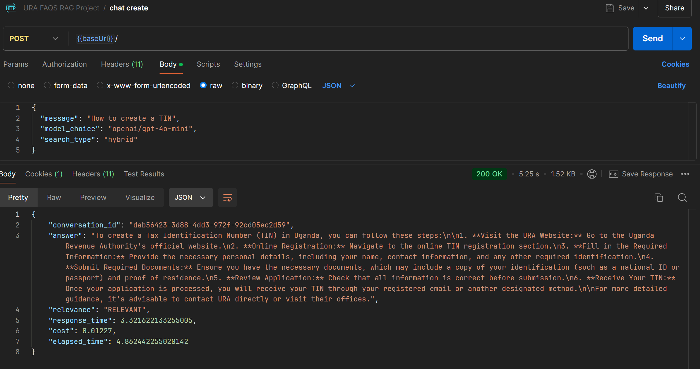
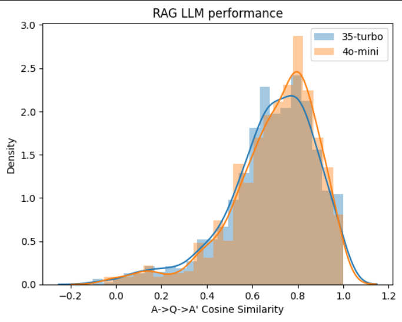
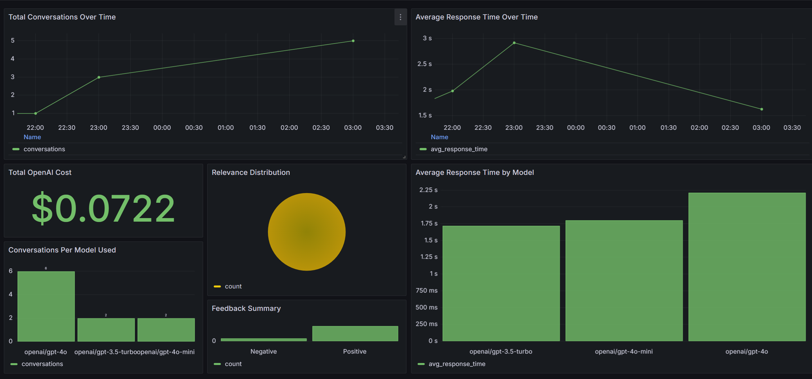

# URA FAQs LLM Powered Chatbot API
___
Taxpayers in Uganda face difficulties accessing clear and organized tax information because the FAQs on the Uganda Revenue Authority (URA) website are scattered and unstructured. This project addresses the problem by developing a chatbot powered by Retrieval-Augmented Generation (RAG) using the scraped URA FAQs. The chatbot, communicating with GPT-4O-mini, will provide precise and immediate answers to users' tax-related questions, enhancing access to essential tax information.


### Overview
This project is a URA FAQ Chatbot API powered by Retrieval-Augmented Generation (RAG), Elasticsearch, and OpenAI GPT models. It includes a web scraping script that updates FAQs from the URA website, with all data stored in PostgreSQL. Grafana is used for system monitoring.

It embeds the following key features
1. Hybrid,text,vector search: Combining, and retaining keyword and vector search in Elasticsearch for accurate FAQ retrieval.
2. RAG: Generates natural language responses using GPT models based on retrieved FAQs.
3. Web Scraping: Automatically updates the FAQ database with data from the URA website.
4. Feedback System: Stores user feedback in PostgreSQL for improving response quality.
5. Django API: Provides endpoints for chatbot interactions, feedback, and history management.
6. Grafana: Monitors system metrics, including API usage and Elasticsearch health.
7. Dockerized: All components run in Docker containers for scalability and easy deployment.

This chatbot delivers accurate, up-to-date responses and offers real-time performance monitoring, making it a scalable and automated solution for URA FAQs.

___

### Dataset
This dataset contains a collection of FAQs scraped from the URA (https://ura.go.ug/en/general-faqs/) website. It includes the following fields:

- Question: A frequently asked question from URA's public users.
- Answer: The official response provided by URA.
- Section: The category under which the FAQ falls, such as "Import & Export FAQs," "Domestic Taxes FAQs," "Processes & Systems FAQs," and "General FAQs."

The dataset provides a structured collection of questions and answers across various tax-related topics and processes. Each entry is organized to help users quickly access important URA information.
___

### Technologies
- Python 3.12
- Docker and Docker Compose for containerization
- ElasticSearch for text,vector and hybrid search
- Django Rest Framework and Django as the API interface (see Background for more information on Flask)
- Grafana for monitoring and PostgreSQL as the datasource
- OpenAI as the LLM
___

### Getting Started
Follow these steps to set up and run the URA FAQs LLM Chatbot API.

### 1. Clone the Repository

First, clone the repository to your local machine:

```bash
git clone git@github.com:okellodaniel/URA_Faq_llm_Chatbot_API.git
cd URA_Faq_llm_Chatbot_API
```

### 2. Set Up a Virtual Environment

Create a virtual environment for the project:

```bash
# For Linux/Mac
python3 -m venv venv
source venv/bin/activate

# For Windows
venv\Scripts\activate
```

### 3. Install Project Dependencies

Install all the required packages:

```bash
pip install -r requirements.txt
```

### 4. Build and Start Docker Containers

Use Docker Compose to build and bring up the required containers:

```bash
docker-compose up --build
```

### 5. Configure Environment Variables

Create a `.env` file in the root of the project directory and populate it with the following details:

```txt
# Postgres Configuration
POSTGRES_HOST=localhost
POSTGRES_DB=ura_faqs
POSTGRES_USER=postgres
POSTGRES_PASSWORD=postgres
POSTGRES_PORT=5432

# ElasticSearch Configuration
ELASTIC_URL_LOCAL=http://localhost:9200
ELASTIC_URL=http://elasticsearch:9200
ELASTIC_PORT=9200

# Other Configuration
MODEL_NAME=multi-qa-MiniLM-L6-cos-v1
INDEX_NAME=ura_faqs

# OpenAI API Key
OPENAI_API_KEY=<Your-openai-key>

# Azure Storage Configuration
AZURE_STORAGE_CONN_STRING="<reachout-for-conn-string>"
AZURE_STORAGE_CONTAINER="urafaqs"
```

### 6. Install Postman for API Testing

- [Download Postman](https://dl.pstmn.io/download/latest) and install it.
- After installation, import the Postman collection:
  - Navigate to the `misc` folder of the project.
  - Import the `URA FAQS RAG Project.postman_collection.json` file into Postman.
  - Use this collection to test the API endpoints.

### 7. Run the API

Once the Docker containers are up, the API will be running on port `8000`. You can access the API at:

```
http://localhost:8000
```

### 8. Access Grafana for Analytics

Grafana will be available on port `3000`. To access it:

- Open Grafana by navigating to `http://localhost:3000` in your browser.
- Login with the default credentials:
  - **Username**: `admin`
  - **Password**: `admin`

### 9. Configure Grafana Dashboard

Once logged into Grafana:

1. Navigate to the dashboard section.
2. Click on **New Dashboard**.
3. Proceed to **Import**.
4. Use the template located in `/misc/URA Faqs Analytics Dashboard.json`.
5. If the dashboard doesn't reflect properly, ensure that the data sources are correctly configured.
___
### Code Structure
The application codebase resides in the URA_RAG folder. The application structure is as follows
#### app
The django Rest Framework application API. This contains
- [models.py](./app/rag/models.py) - Database models representing the conversation and feedback models.
- [raglogic.py](./app/rag/raglogic.py) - RAG logic of the project
- [services.py](./app/rag/services.py) - Acts as an ORM for the interaction between the views and the database layer
- [views.py](./app/rag/views.py) - The views contain the API routes
#### notebooks
- [evaluation.ipynb](./notebooks/evaluation.ipynb) - Contains logic for evaluating the RAG application
- [ground_truth.ipynb](./notebooks/ground_truth.ipynb) - Contains logic used in generating the ground truth dataset

#### scripts
- [scrapper.py](.scrapper.py) - Contains the logic for scrapping FAQ data off the URA website
- [rag.py](./scripts/rag.py) - Script for indexing the faqs data.
- [azure_storage_file_downloader.py](./scripts/azure_storage_file_downloader.py) - Script for downloading project data files into the `data` directory.
- [azure_storage_uploader.py](./scripts/azure_storage_uploader.py) - Script for uploading project data files into an azure blob container.
___
### Endpoints

The chatbot API presents the following endpoints
#### Chat Creation Endpoint `POST` `/chats`

This endpoint allows users to ask questions to the chatbot and receive answers in real-time.

##### Request

A user sends a `POST` request with the following payload structure:

```json
{
  "message": "What is an instant TIN?",
  "model_choice": "openai/gpt-4o",
  "search_type": "hybrid"
}
```

**Payload fields**: 
- **message**: (String) The question to be passed to the chatbot.
- **model_choice**: (String) The model to be used for generating the answer (`openai/gpt-4o`, `openai/gpt-3.5`, `openai/gpt-4o-mini`).
- **search_type**: (String) The type of search used:
  - `text` - Keyword-based search.
  - `hybrid` - Combines text and vector search for enhanced relevance.
  - `vector` - Vector-based semantic search.

##### Response:

```json
{
  "conversation_id": "d92ca4e3-c028-46d2-80aa-1d14a7303d96",
  "answer": "An instant TIN (Tax Identification Number) refers to a TIN that is issued immediately upon application...",
  "relevance": "RELEVANT",
  "response_time": 1.386,
  "cost": 0.00534,
  "elapsed_time": 2.761
}
```

**Response fields**:
- **conversation_id**: (String) A unique identifier for the chat session.
- **answer**: (String) The chatbot’s response to the user's question.
- **relevance**: (String) Indicates whether the response is relevant (`RELEVANT` or `IRRELEVANT`).
- **response_time**: (Float) Time in seconds taken to generate the response.
- **cost**: (Float) The cost associated with processing the API request.
- **elapsed_time**: (Float) Total time in seconds taken to process the request.

#### Clear Chat History Endpoint `POST` `/clear-history`

Clears the current chat session's history.

##### Request

A `POST` request is made with no body.

##### Response:

```json
{
  "message": "Chat history cleared successfully."
}
```

**Response fields**:
- **message**: (String) Confirmation that the chat history was cleared.

#### Retrieve Conversation Endpoint `GET` `/conversations/{id}`

Fetches the details of a specific conversation using its ID.

##### Request

A `GET` request is made to retrieve the conversation details by passing the conversation ID in the URL path.

##### Response:

```json
{
  "conversation_id": "abcd-1234-efgh-5678",
  "messages": [
    {
      "question": "What is an instant TIN?",
      "answer": "An instant TIN (Tax Identification Number)..."
    }
  ]
}
```

**Response fields**:
- **conversation_id**: (String) The unique identifier for the chat session.
- **messages**: (Array) List of questions and answers from the conversation.

#### Recent Conversations Endpoint `GET` `/recent-conversations`

Retrieves a list of recent conversations.

##### Request

A `GET` request can include an optional query parameter `relevance` to filter conversations based on relevance.

##### Response:

```json
[
  {
    "conversation_id": "abcd-1234-efgh-5678",
    "relevance": "RELEVANT"
  },
  {
    "conversation_id": "ijkl-5678-mnop-1234",
    "relevance": "IRRELEVANT"
  }
]
```

**Response fields**:
- **conversation_id**: (String) The unique identifier for each conversation.
- **relevance**: (String) Indicates whether the response in the conversation was relevant.

#### Feedback Submission Endpoint `POST` `/feedback`

Allows users to submit feedback on the chatbot's performance for a specific conversation.

##### Request

A `POST` request is made with the following payload structure:

```json
{
  "conversation_id": "abcd-1234-efgh-5678",
  "feedback": "Great response!"
}
```

**Payload fields**: 
- **conversation_id**: (String) The ID of the conversation being reviewed.
- **feedback**: (String) The user's feedback.

##### Response:

```json
{
  "message": "Feedback saved successfully."
}
```

**Response fields**:
- **message**: (String) Confirmation that the feedback was saved.

#### Feedback Statistics Endpoint `GET` `/feedback-stats`

Retrieves aggregated statistics of user feedback for the chatbot.

##### Response:

```json
{
  "total_feedbacks": 100,
  "positive_feedbacks": 80,
  "negative_feedbacks": 20
}
```

**Response fields**:
- **total_feedbacks**: (Integer) The total number of feedback submissions.
- **positive_feedbacks**: (Integer) The number of positive feedback submissions.
- **negative_feedbacks**: (Integer) The number of negative feedback submissions.

### Logging

The API is configured to log important events, such as when a chatbot request is received or an error occurs during processing. These logs help with debugging and performance monitoring.

### Error Handling

The API includes robust error handling, and common error responses include:

- `400` - Bad Request: Invalid input or missing required fields.
- `500` - Internal Server Error: An error occurred during processing.

___
### Retrieval evaluation
For retrieval evaluation,below are the metrics 
- Hit Rate: 89.47%
- Mean Reciprocal Rank (MRR): 76.81%
- Recall @ k: 89.47%
- Normalized Discounted Cumulative Gain (NDCG @ k): 0.00%
- Precision @ k: 17.89%
___
### RAG flow evaluation
#### LLM-as-a-Judge
LLM as a judge was used to evaluate the quality of the RAG flow. 2 models were used for this purpose i.e.
- gpt-4o-mini: Sampled 200 faqs
- gpt-3.5-turbo: Sampled 200 faqs

**gpt-3.5-turbo**
- 89(44.5%) RELEVANT
- 87 (43.5%) PARTLY_RELEVANT
- 24 (12%) NON_RELEVANT

**gpt-4o-mini**
- 175(87.5%) RELEVANT
- 19 (9.5%) PARTLY_RELEVANT
- 8 (3.0%) NON_RELEVANT

#### Cosine similarity

Cosine similarity was also used to evaluate the rag performance.

 

This graph represents the distribution of cosine similarities between the original answers (A) and the regenerated answers (A') for two different language models (LLMs) gpt-3.5-turbo represented in blue and gpt-4o-mini (represented in orange). 

Key insights include;
- Both models showed a similar distribution, with a peak around the 0.7 to 0.8 range. This indicated that for the majority of cases, both models generated responses that were highly similar to the original answers (high cosine similarity).
- Both curves peaked around 0.7 - 0.8, meaning most answers were closely related to their original counterparts.
- GPT-4o-mini had a slightly higher peak, showing more frequent high-similarity answers compared to GPT-3.5-turbo.
- GPT-4o-mini had a slightly higher mean cosine similarity (0.699) compared to GPT-3.5-turbo (0.683), indicating that, on average, GPT-4o-mini generated answers that were more similar to the original ones.
- Both models performed well in generating similar answers to the original, with cosine similarities clustering around 0.7 to 0.8.
- GPT-4o-mini demonstrated slightly better performance in terms of generating closer matches to the original answers, with a higher mean and more consistent results (lower variance).
- GPT-3.5-turbo showed more variance and outliers, indicating that while it performs well on average, some of its answers deviate more significantly from the original answers.
___
### Monitoring


1. Total Conversations Over Time is presented as a Time-series graph that displays the number of conversations over time.
It is powered by a query that counts the number of faqs in the over time intervals.

```sql
SELECT
  date_trunc('hour', timestamp) AS "time",
  COUNT(*) AS "conversations"
FROM
  rag_conversation
WHERE
  timestamp BETWEEN $__timeFrom() AND $__timeTo()
GROUP BY
  "time"
ORDER BY
  "time"

```
2. Average Response Time Over Time is presented as a time-series graph thatshows how response times vary over time.It is powered by a query that aggregates the response_time field over time intervals.

```sql
SELECT
  date_trunc('hour', timestamp) AS "time",
  AVG(response_time) AS "avg_response_time"
FROM
  rag_conversation
WHERE
  timestamp BETWEEN $__timeFrom() AND $__timeTo()
GROUP BY
  "time"
ORDER BY
  "time"

```
3. Total OpenAI Cost Over Time Is a single Stat panel that displays the total cost incurred for using OpenAI's services over the selected time range. It provides insight into your expenditure.

```sql
SELECT
  SUM(openai_cost) AS "total_cost"
FROM
  rag_conversation
WHERE
  timestamp BETWEEN $__timeFrom() AND $__timeTo()

```
4. Relevance Distribution,presented as a Pie chart that visualizes the distribution of relevance levels in your conversations. It helps you understand how relevant your responses are according to your evaluation criteria.

```sql
SELECT
  relevance,
  COUNT(*) AS "count"
FROM
  rag_conversation
WHERE
  timestamp BETWEEN $__timeFrom() AND $__timeTo()
GROUP BY
  relevance

```
5. Feedback Summary Is represented as a Bar chart that summarizes the number of positive and negative feedback entries. This panel allows you to gauge user satisfaction levels and identify areas for improvement.

```sql
SELECT
  CASE
    WHEN feedback = 1 THEN 'Positive'
    WHEN feedback = -1 THEN 'Negative'
    ELSE 'Neutral'
  END AS "feedback_type",
  COUNT(*) AS "count"
FROM
  rag_feedback
WHERE
  timestamp BETWEEN $__timeFrom() AND $__timeTo()
GROUP BY
  "feedback_type"

```
6. Conversations Per Model Used is presented as a Bar chart that compares the number of conversations per model (e.g., GPT-3.5, GPT-4). It helps you analyze the usage and popularity of different models.

```sql
SELECT
  model_used,
  COUNT(*) AS "conversations"
FROM
  rag_conversation
WHERE
  timestamp BETWEEN $__timeFrom() AND $__timeTo()
GROUP BY
  model_used
ORDER BY
  "conversations" DESC

```
7. Average Response Time by Model is presented as a Bar chart that shows the average response time for each model used. This panel helps you assess which models are more efficient in terms of response time.

```sql
SELECT
  model_used,
  AVG(response_time) AS "avg_response_time"
FROM
  rag_conversation
WHERE
  timestamp BETWEEN $__timeFrom() AND $__timeTo()
GROUP BY
  model_used
ORDER BY
  "avg_response_time" ASC

```

## Acknowledgements
___
I would like to extend my gratitude to the DataTalks Club team for their invaluable efforts in providing the foundational knowledge that enabled the development of this RAG application.